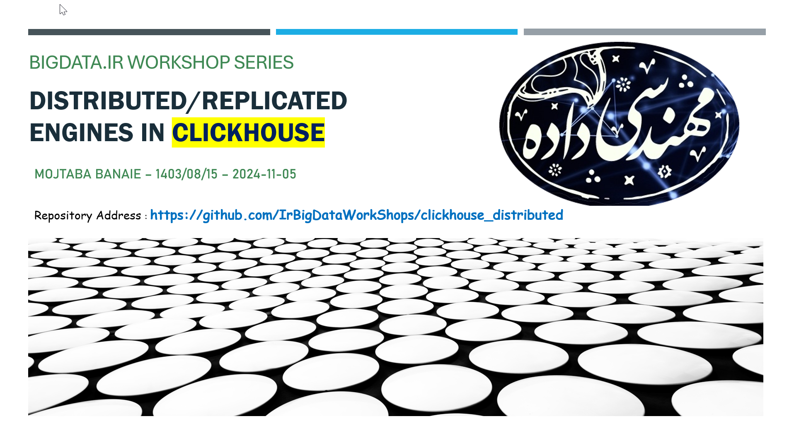

# ClickHouse Cluster Setup: Distributed and Replicated Tables for NYC Taxi Data

This repository contains tutorials on setting up **ClickHouse clusters** to handle **NYC Taxi data** stored in **Parquet files**. We cover two key configurations for distributed and replicated setups.

- download some sample parquet files here : [TLC Trip Record Data]([TLC Trip Record Data - TLC](https://www.nyc.gov/site/tlc/about/tlc-trip-record-data.page))

## Topics Covered:

### 1. Distributed Engine for NYC Taxi Data (3 Nodes: 3 Shards, 1 Replica)

Learn how to configure a **3-node ClickHouse cluster** with **3 shards and 1 replica**. We’ll use the **Distributed** engine to query NYC Taxi data stored in Parquet files, demonstrating how to efficiently distribute and parallelize queries across multiple nodes.

### 2. Distributed and Replicated Tables for NYC Taxi Data (4 Nodes: 2 Shards, 2 Replicas)

In this section, we configure a **4-node cluster** with **2 shards and 2 replicas** using the **ReplicatedMergeTree** engine. You'll learn how to ensure data replication for fault tolerance while maintaining distributed query capabilities across the cluster.

## Features:

- **Efficient Querying**: Use the **Distributed** engine to run parallel queries on distributed datasets.
- **Replication for Fault Tolerance**: Learn how to configure replication using **ReplicatedMergeTree** for high availability.
- **ClickHouse Keeper**: No external Zookeeper needed; ClickHouse’s built-in keeper manages metadata and replication.

## Prerequisites:

- ClickHouse 21.3+ with **ClickHouse Keeper** enabled.
- NYC Taxi data in **Parquet format**.

---

### Acknowledgements

Special thanks to **Suffyan Asad** for his work on the article [Beginner’s Guide to ClickHouse: Introduction, Features, and Getting Started](https://medium.com/@suffyan.asad1/beginners-guide-to-clickhouse-introduction-features-and-getting-started-55315107399a). The main inspiration and parts of the code in this tutorial are taken from his work.
